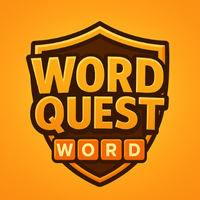
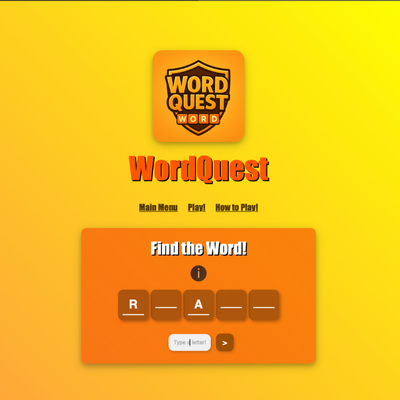
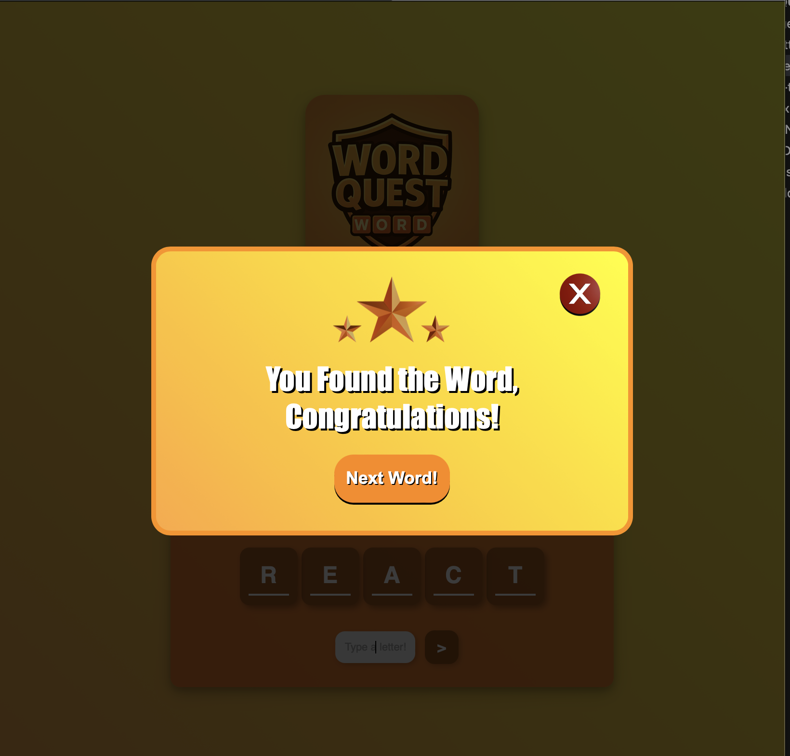
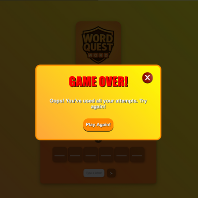

# WordQuest - Word Guessing Game

WordQuest is an engaging word guessing game where you test your vocabulary skills by guessing the given words. Can you solve them all before running out of attempts?

## Features  
- The player guesses letters one by one.  
- The number of attempts decreases with incorrect guesses.  
- The game progresses when the word is correctly guessed.  

## Purpose  
This project was created to **improve my skills in JavaScript, HTML, and CSS** while developing an interactive and fun game.  

## Technologies Used  
- **JavaScript**
- **HTML**
- **CSS**

## How to Play?
1. Open the game in your browser  
2. Start guessing letters one by one  
3. Complete the word before running out of attempts! 

## Screenshots

  
  
  

## Live Demo
🔗 [Play the Game](https://magicmouseee.github.io/WordQuest/)  
