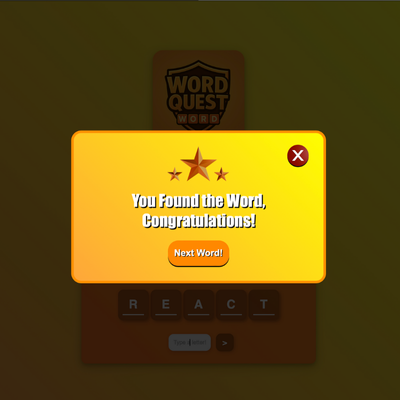

# WordQuest

This project is a simple word guessing game where you progress by guessing the given words.  

## Features  
- The player guesses letters one by one.  
- The number of attempts decreases with incorrect guesses.  
- The game progresses when the word is correctly guessed.  

## Purpose  
This project was created as a personal self-improvement project to enhance my skills in JavaScript, HTML, and CSS.  

## Technologies Used  
- JavaScript  
- HTML  
- CSS

## Screenshots

